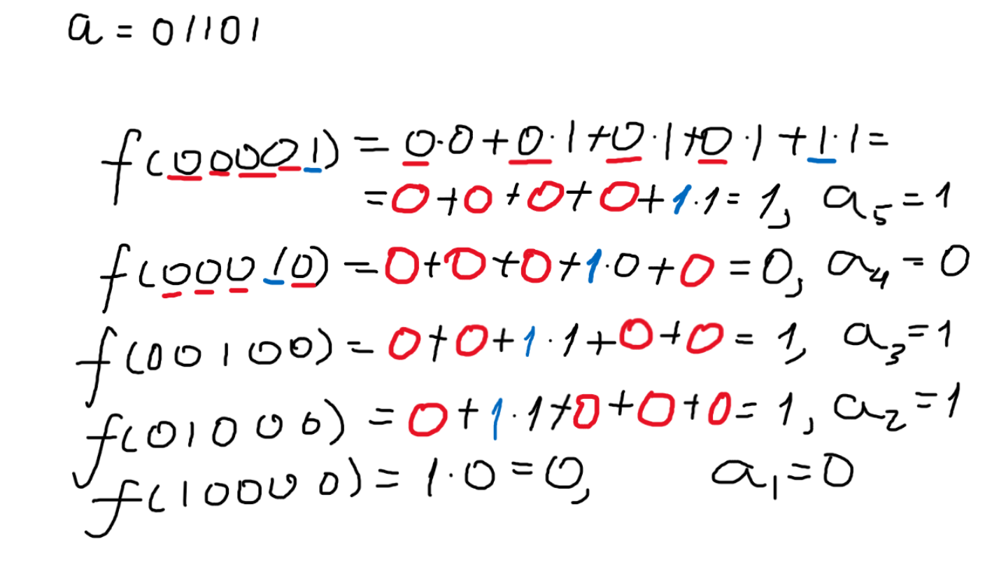
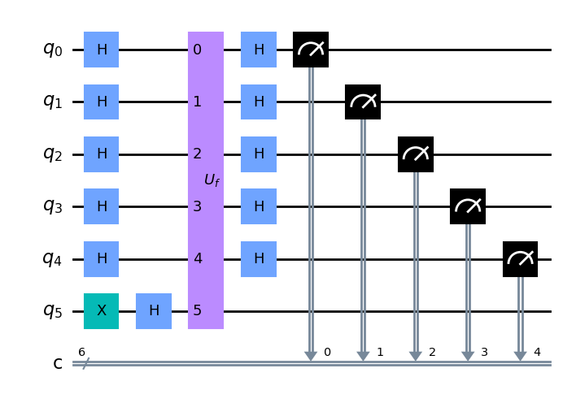

# Bernstein-Vazirani
Our task is to find a secret string $a$, when we are only given a hidden function again as in Deutsh-Jozsa algorithm, which in quantum implementation is "oracle". So the hidden function looks like that: $f(x) = a \cdot x$, where operation of dot is scalar multiplication which looks like this: $x \cdot y = x_1 y_1 \oplus x_2 y_2 \oplus ... \oplus x_ny_n$.

## Classical solution

We first pass value of $f(000...1)$ and if we get 1, then the last character is equal to 1, if 0, then last character is equal to 0, and continue doing that until reaching argument of $1000...0$.

## Quantum solution

Here we do the same thing we did with Deutsh-Jozsa algorithm, but let's take a look at what happens after applying quantum oracle:

$$
U_f \frac{1}{\sqrt{2^n}} \sum_{x = 0}^{2^n - 1} \lvert x \rangle \lvert - \rangle = 
\frac{1}{\sqrt{2^n}} \sum_{x = 0}^{2^n - 1} (-1)^{f(x)} \lvert x \rangle \lvert - \rangle= 
\frac{1}{\sqrt{2^n}} \sum_{x = 0}^{2^n - 1} (-1)^{a \cdot x} \lvert x \rangle \lvert - \rangle
$$

Ignoring last qubit again:

$$
\frac{1}{\sqrt{2^n}} \sum_{x = 0}^{2^n - 1} (-1)^{a \cdot x}
$$

Using formula of Hadamard transform on state $\lvert y \rangle$, we can get formula of getting state $\lvert y \rangle$ from another state.

$$
H \lvert y \rangle = \frac{1}{\sqrt{2^n}} \sum_{x = 0}^{2^n - 1} (-1)^{y \cdot x} \lvert x \rangle \therefore H \frac{1}{\sqrt{2^n}} \sum_{x = 0}^{2^n - 1} (-1)^{y \cdot x} \lvert x \rangle = \lvert y \rangle
$$

In this case applying Hadamard gate on last n qubits, will give the hidden string :)

$$
H \frac{1}{\sqrt{2^n}} \sum_{x = 0}^{2^n - 1} (-1)^{a \cdot x} \lvert x \rangle = \lvert a \rangle
$$