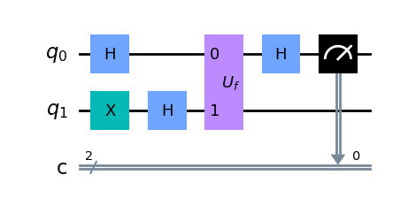
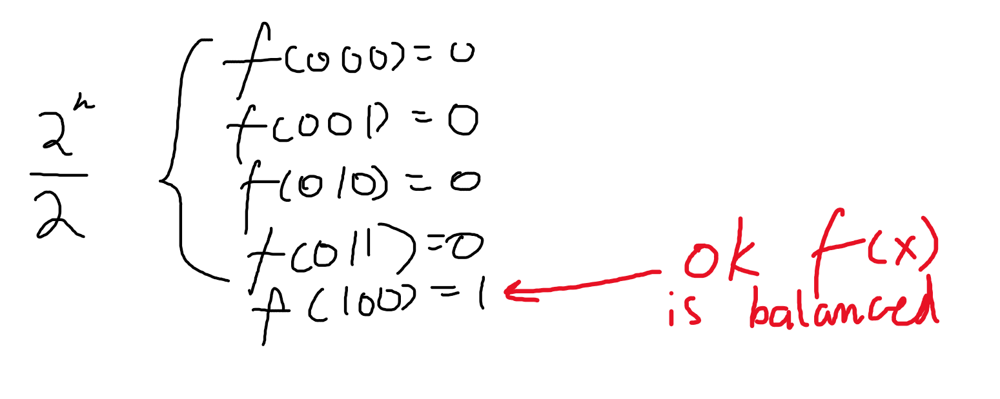
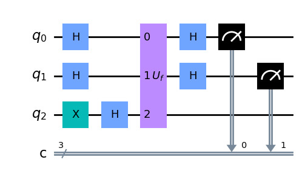

# Deutsh's algorithm
Deutsh's algorithm is the beginning of Deutsh-Jozsa algorithm and is a special case of it. The task is: we are given a hideen function $f(x)$, where $x$ is either $0$, or $1$. Our task is to determine wether $f(0) = f(1)$ or not. The task is very simple and can be easily done with classical computer, but we will learn about this one.

In quantum computing we have object called "oracle", which is quantum analog of hidden function. As long as it is quantum gate, it is reversable. Quantum oracle maps value $\lvert x \rangle\lvert y \rangle$ to $\lvert x \rangle \lvert y \oplus f(x) \rangle$:

$$
U_f \lvert x \rangle \lvert y \rangle = \lvert x \rangle \lvert y \oplus f(x) \rangle
$$

But if $\lvert y \rangle = \lvert - \rangle$, we can see strange effect of $U_f$ gate, that starts to <i>write</i> information into <i>read only qubit</i> $ \lvert x \rangle $:

$$
U_f \lvert x \rangle \lvert - \rangle = U_f \lvert x \rangle \frac{1}{\sqrt{2}} (\lvert 0 \rangle - \lvert 1 \rangle) = \lvert x \rangle \frac{1}{\sqrt{2}} (\lvert f(x) \rangle - \lvert 1 \oplus f(x) \rangle)
$$

If we paste different values of $f(x)$, we get:

$$
f(x) = 0 \to \lvert x \rangle \frac{1}{\sqrt{2}} (\lvert 0 \rangle - \lvert 1 \rangle) \\
f(x) = 1 \to \lvert x \rangle \frac{1}{\sqrt{2}} (\lvert 1 \rangle - \lvert 0 \rangle)
$$

So that we can get this strange result:

$$
U_f \lvert x \rangle \lvert - \rangle = (-1)^{f(x)} \lvert x \rangle \lvert - \rangle
$$

This is called <i>phase kickback trick</i> and it will be used in the algorithm.

## Circuit

Firstly we apply hadamard and x gates on both qubits at the start:

$$
\lvert \psi_1 \rangle = H \lvert 0 \rangle H (X \lvert 0 \rangle) = H \lvert 0 \rangle H \lvert 1 \rangle = \frac{1}{2} (\lvert 0 \rangle + \lvert 1 \rangle) (\lvert 0 \rangle - \lvert 1 \rangle)
$$

Applying quantum oracle:

$$
\lvert \psi_2 \rangle = \frac{1}{2} (\lvert 0 \rangle + \lvert 1 \rangle) (\lvert 0 \rangle \lvert f(0) \rangle - \lvert 1 \rangle \lvert 1 \oplus f(1) \rangle) = \frac{1}{2}((-1)^{f(0)} \lvert 0 \rangle (\lvert 0 \rangle - \lvert 1 \rangle) + (-1)^{f(1)} \lvert 1 \rangle (\lvert 0 \rangle - \lvert 1 \rangle)) \\
= \frac{(-1)^{f(0)}}{2} (\lvert 0 \rangle + (-1)^{f(0) \oplus f(1)}) (\lvert 0 \rangle - \lvert 1 \rangle)
$$

Ignore global phase + last qubit:

$$
\frac{1}{\sqrt{2}} (\lvert 0 \rangle + (-1)^{f(0) \oplus f(1)})
$$

Applying hadamard transform again:

$$
\frac{1}{2} ((\lvert 0 \rangle + \lvert 1 \rangle) + ((-1)^{f(0) \oplus f(1)} \lvert 0 \rangle - (-1)^{f(0) \oplus f(1)} \lvert 1 \rangle)) = \\
\frac{1}{2} ((1 + (-1)^{f(0) \oplus f(1)})\lvert 0 \rangle + (1 - (-1)^{f(0) \oplus f(1)})\lvert 1 \rangle)
$$

If $f(0) = f(1)$, then state is equal to:

$$
\frac{1}{2} ((1 + (-1)^0)\lvert 0 \rangle + (1 - (-1)^0)\lvert 1 \rangle) =
\frac{1}{2} (2 \lvert 0 \rangle + 0 \lvert 1 \rangle) = {\bf \lvert 0 \rangle}
$$

If not, then:

$$
\frac{1}{2} ((1 + (-1)^1)\lvert 0 \rangle + (1 - (-1)^1)\lvert 1 \rangle) =
\frac{1}{2} (0 \lvert 0 \rangle + 2 \lvert 1 \rangle) = {\bf \lvert 1 \rangle}
$$

# Deutsh-Jozsa algorithm
Now we are given boolean function $f(x_1, x_2, x_3, ..., x_n)$ which is promised to be either constant, or balanced. Balanced function is function that gives 0 on half cases and 1 on other half, for example: $f(00) = 0, f(01) = 1, f(10) = 1, f(11) = 0$. Constant function is function that always gives one constant result: $f(00) = 0, f(01) = 0, f(10) = 0, f(11) = 0$. The task is to find out wether function is constant or balanced.

## Classical solution

If we went through half of possible results + 1 and we didn't meet another value, then function is constant, if we met, then function is balanced. In worst case, we go through half of results been the same which is $2^{n - 1}$ iterations. For instance, if $n = 200$, then amount of iterations required would be: $160693804425899027554196209234116260252220...$.

## Quantum solution

We apply x gate on last qubit:

$$ \lvert \psi_1 \rangle = I^{\otimes n} \lvert 0 \rangle^{\otimes n} X \lvert 0 \rangle =  \lvert 0 \rangle^{\otimes n} \lvert 1 \rangle $$

And then apply hadamard gates on all qubits (and prepare $\lvert - \rangle$ state for phase kickback):

$$ \lvert \psi_2 \rangle = H^{\otimes (n + 1)} \lvert 0 \rangle^{\otimes n} \lvert 1 \rangle = \lvert + \rangle^{\otimes n} \lvert - \rangle = \frac{1}{\sqrt{2^{n+1}}} \sum_{x = 0}^{2^n - 1} \lvert x \rangle (\lvert 0 \rangle - \lvert 1 \rangle) $$

Then we apply phase oracle and use phase kickback trick to simplify the result:

$$ \lvert \psi_3 \rangle = U_f \frac{1}{\sqrt{2^{n+1}}} \sum_{x = 0}^{2^n - 1} \lvert x \rangle (\lvert 0 \rangle - \lvert 1 \rangle) = \frac{1}{\sqrt{2^{n+1}}} \sum_{x = 0}^{2^n - 1} (-1)^{f(x)} \lvert x \rangle (\lvert 0 \rangle - \lvert 1 \rangle) $$

Then we ignore last qubit as in deutsh algorithm again:

$$ \lvert \psi_3^\prime \rangle = \frac{1}{\sqrt{2^n}} \sum_{x = 0}^{2^n - 1} (-1)^{f(x)} \lvert x \rangle $$

And apply hadamard transform on all qubits left:

$$ \lvert \psi_4^\prime \rangle = H^{\otimes n}\frac{1}{\sqrt{2^n}} \sum_{x = 0}^{2^n - 1} (-1)^{f(x)} \lvert x \rangle = \frac{1}{2^n} \sum_{x = 0}^{2^n - 1} \sum_{y = 0}^{2^n - 1} (-1)^{f(x) + x \cdot y} \lvert y \rangle $$

If function is constant then probability of state $\lvert 0 \rangle^{\otimes n}$ is 1:

$$
P(\lvert 0 \rangle^{\otimes n}) = |\frac{1}{2^n} \sum_{x = 0}^{2^n - 1}(-1)^{f(x)}|^2 = |\frac{2^n (-1)^{f(x)}}{2^n}|^2 = |(-1)^{f(x)}|^2 = 1
$$

If function is balanced then probability of the state is 0:

$$
P(\lvert 0 \rangle^{\otimes n}) = |\frac{1}{2^n} \sum_{x = 0}^{2^n - 1}(-1)^{f(x)}|^2 = |\frac{2^{n - 1} (-1)^{0} + 2^{n - 1} (-1)^1}{2^n}|^2 = 0
$$